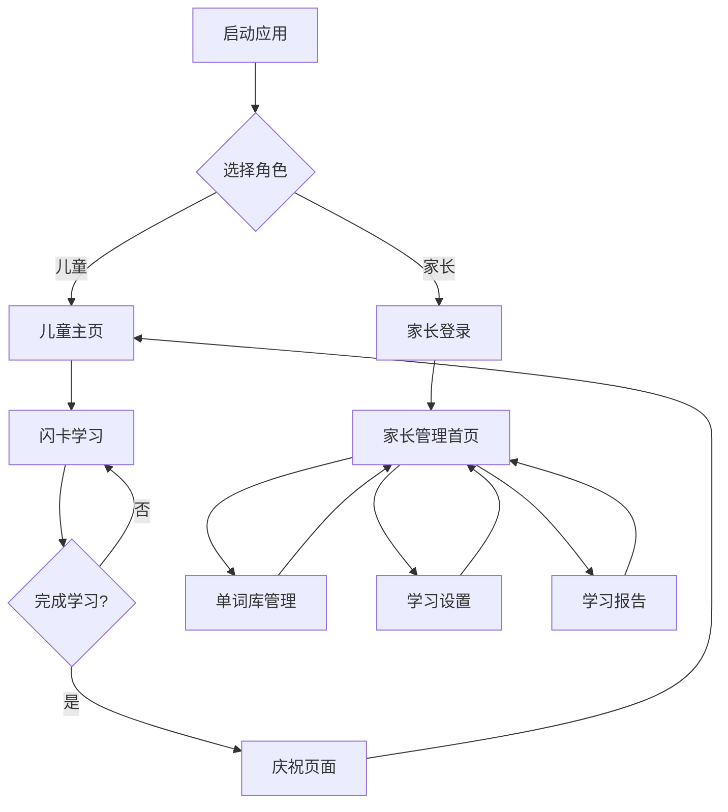

## 1. 产品概述
David's Mom是一款专为儿童英语学习设计的H5应用，采用双端系统架构，为家长提供管理功能，为儿童提供趣味学习体验。通过科学的记忆曲线算法和丰富的互动设计，帮助孩子高效学习英语单词。

目标用户：3-12岁儿童及其家长，解决传统英语学习枯燥、效率低的问题，通过游戏化学习提升孩子的英语学习兴趣和效果。

**重要约束**：家长管理界面必须使用简体中文，确保国内用户操作便利；所有外部服务必须支持中国大陆地区访问，无需VPN。

## 2. 核心功能

### 2.1 用户角色
| 角色 | 注册方式 | 核心权限 |
|------|----------|----------|
| 家长用户 | 手机号注册 | 管理单词库、设置学习计划、查看学习报告、配置应用设置 |
| 儿童用户 | 家长端创建 | 使用闪卡学习、查看学习进度、参与学习游戏 |

### 2.2 功能模块
应用包含以下主要页面：
1. **儿童学习主页**：学习模式切换、今日学习任务、学习统计展示
2. **闪卡学习页面**：单词展示、图片提示、详情查看、发音播放、学习反馈
3. **学习完成页面**：祝贺动画、学习统计、奖励展示
4. **家长管理首页**：学习概览、快速设置、学习报告入口
5. **单词库管理页面**：单词列表、添加/编辑单词、批量导入、分类管理
6. **学习设置页面**：每日学习量设置、学习提醒、难度调节
7. **学习报告页面**：进度统计、掌握程度、错误单词、学习趋势
8. **用户切换页面**：角色切换、儿童头像选择

### 2.3 页面详情
| 页面名称 | 模块名称 | 功能描述 |
|----------|----------|----------|
| 儿童学习主页 | 学习模式卡片 | 显示闪卡学习入口，点击开始学习今日任务 |
| 儿童学习主页 | 今日任务进度 | 可视化展示今日学习进度和剩余单词数量 |
| 儿童学习主页 | 学习统计 | 显示连续学习天数、累计单词数等成就数据 |
| 闪卡学习页面 | 单词展示区 | 居中显示当前单词，支持点击切换显示状态 |
| 闪卡学习页面 | 图片提示区 | 点击空白处显示单词相关图片 |
| 闪卡学习页面 | 详情展示区 | 显示完整信息：音标、中文释义、例句 |
| 闪卡学习页面 | 发音控制区 | 提供美式/英式发音切换和播放按钮 |
| 闪卡学习页面 | 学习反馈区 | 提供"记住了"和"不认识"两个操作按钮 |
| 学习完成页面 | 祝贺动画 | 播放庆祝动画，增强学习成就感 |
| 学习完成页面 | 学习统计 | 显示今日学习单词数、正确率、用时等 |
| 家长管理首页 | 学习概览 | 显示孩子今日学习状态和近期表现 |
| 家长管理首页 | 快速设置 | 快速调整每日学习量和提醒时间 |
| 单词库管理页面 | 单词列表 | 展示所有单词，支持搜索和筛选 |
| 单词库管理页面 | 添加单词 | 输入单词后自动从互联网获取详情、发音和图片，支持手动修改和补充 |
| 单词库管理页面 | 批量导入 | 支持Excel/CSV文件批量导入单词，自动补充缺失的单词信息 |
| 单词库管理页面 | 分类管理 | 创建和管理单词分类标签 |
| 学习设置页面 | 学习量设置 | 设置每日学习单词数量（5-50个） |
| 学习设置页面 | 学习提醒 | 设置每日学习提醒时间和频率 |
| 学习设置页面 | 难度调节 | 根据孩子年龄自动调整单词难度 |
| 学习报告页面 | 进度统计 | 展示学习进度趋势图表 |
| 学习报告页面 | 掌握程度 | 分析孩子对不同单词的掌握情况 |
| 学习报告页面 | 错误单词 | 列出经常出错的单词供复习 |
| 用户切换页面 | 角色切换 | 快速切换家长和儿童模式 |
| 用户切换页面 | 儿童头像 | 选择和更换儿童头像图标 |

## 3. 核心流程

### 儿童学习流程
1. 打开应用进入儿童模式主页
2. 查看今日学习任务和进度
3. 点击开始学习进入闪卡页面
4. 查看单词→点击显示图片→点击查看详情
5. 听发音，选择"记住了"或"不认识"
6. 系统自动进入下一个单词
7. 完成当日任务后显示庆祝页面
8. 查看学习统计和成就

### 家长管理流程
1. 注册登录后进入家长管理首页
2. 查看孩子学习概览和状态
3. 进入单词库管理添加/导入单词
4. 输入单词时系统自动从互联网获取发音、释义、例句和相关图片
5. 检查并修改自动获取的内容，确认保存
6. 设置每日学习量和提醒时间
7. 定期查看学习报告了解进度
8. 根据报告调整学习计划和难度

## 4. 用户界面设计

### 4.1 设计风格
- **主色调**：明亮蓝色(#4A90E2)搭配温暖橙色(#FF9500)，营造活泼友好的学习氛围
- **辅助色**：柔和绿色(#7ED321)表示正确，温馨红色(#FF6B6B)表示需要加强
- **按钮样式**：大圆角设计，高度不小于48px，适合儿童点击操作
- **字体选择**：主要使用思源黑体，标题24-32px，正文18-20px，确保清晰易读
- **布局风格**：卡片式布局，内容模块化，避免信息过载
- **图标风格**：使用圆润的线性图标，符合儿童审美，避免尖锐棱角
- **语言规范**：家长管理界面必须使用简体中文，儿童学习界面以英文为主，可辅以中文提示

### 4.2 页面设计概述
| 页面名称 | 模块名称 | UI元素 |
|----------|----------|--------|
| 儿童主页 | 学习卡片 | 大尺寸圆角卡片，使用渐变背景，中央放置学习图标 |
| 儿童主页 | 进度展示 | 环形进度条，使用动画效果，颜色随进度变化 |
| 闪卡学习 | 单词区域 | 白色背景，黑色大字体，居中显示，字号不小于48px |
| 闪卡学习 | 反馈按钮 | 两个大按钮并排，绿色"记住了"，橙色"不认识" |
| 学习完成 | 庆祝动画 | 彩色纸屑飘落效果，大字体祝贺语，配可爱图标 |
| 家长管理 | 数据卡片 | 简洁的数据展示卡片，使用图标+数字+描述文字 |
| 单词管理 | 操作按钮 | 蓝色主按钮用于添加，红色警告按钮用于删除 |

### 4.3 响应式设计
- **桌面端优先**：基础设计以平板横屏为基准(1024x768)
- **移动端适配**：支持手机竖屏(375x667及以上)，采用单列布局
- **平板优化**：充分利用大屏空间，适当增大交互元素尺寸
- **触控优化**：所有交互元素最小点击区域为48x48px
- **横竖屏切换**：支持设备旋转，自动调整布局

### 4.4 交互设计
- **防误触保护**：儿童模式下隐藏退出按钮，需要特定手势才能退出
- **动画反馈**：所有点击操作都有视觉反馈，增强交互体验
- **语音引导**：关键操作提供语音提示，帮助低龄儿童使用
- **进度保存**：实时保存学习进度，意外退出后可恢复学习
- **加载优化**：使用骨架屏和渐进式加载，减少等待焦虑