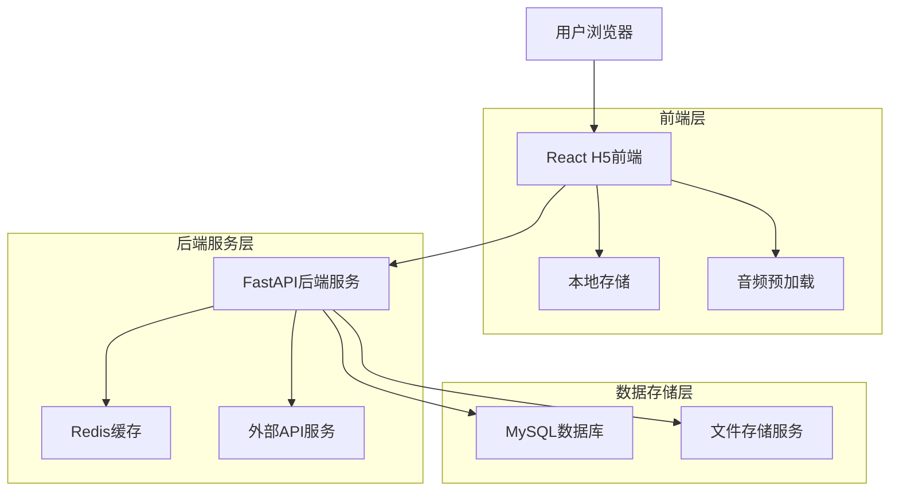
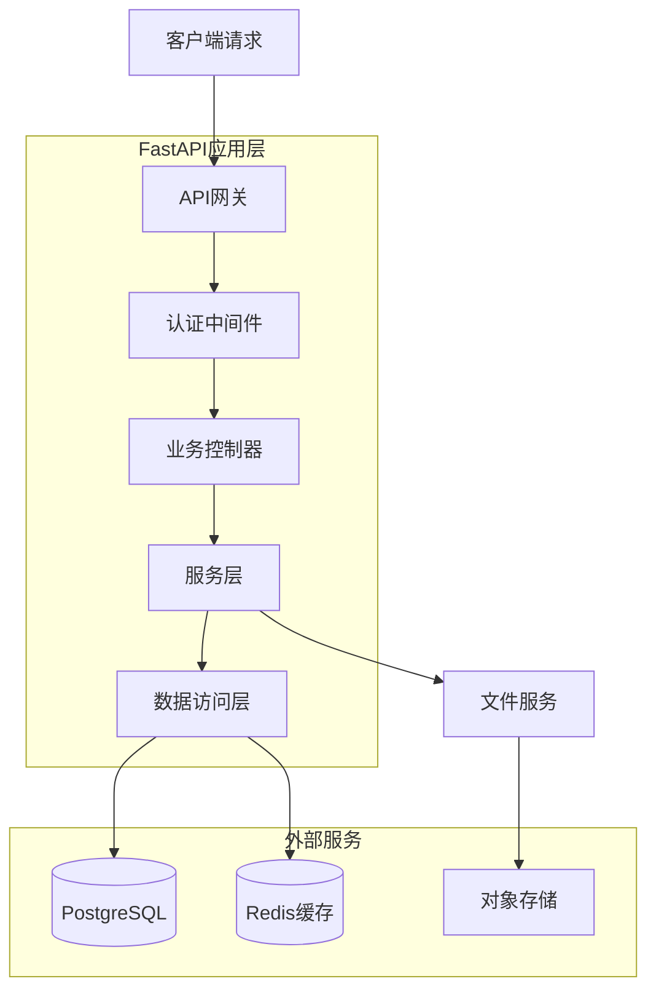
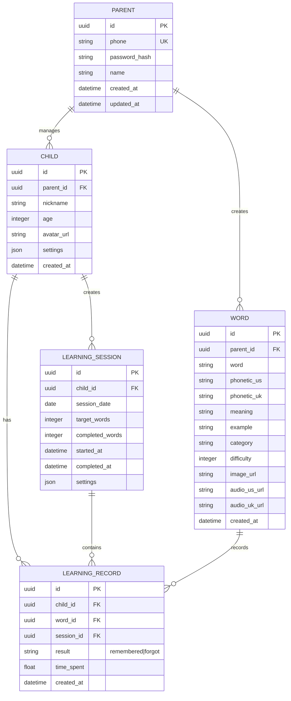

## 1. 架构设计



## 2. 技术描述

* **前端框架**：React18 + TypeScript + Vite

* **状态管理**：Zustand

* **UI框架**：Ant Design Mobile + 自定义组件

* **样式方案**：TailwindCSS + CSS Modules

* **构建工具**：Vite

* **初始化工具**：vite-init

* **后端框架**：Python3.11 + FastAPI

* **数据库**：MySQL 8.0

* **缓存**：Redis

* **文件存储**：本地存储 + CDN

* **部署平台**：Vercel (前端) + Railway (后端)

* **国际化支持**：react-i18next，支持中文界面切换

* **API服务**：优先使用国内可访问服务（有道、百度、必应等）

## 3. 路由定义

| 路由路径              | 页面功能   | 访问权限 |
| ----------------- | ------ | ---- |
| /                 | 角色选择页  | 公开访问 |
| /child            | 儿童学习主页 | 儿童用户 |
| /child/flashcard  | 闪卡学习页面 | 儿童用户 |
| /child/complete   | 学习完成页面 | 儿童用户 |
| /parent/login     | 家长登录页  | 公开访问 |
| /parent/dashboard | 家长管理首页 | 家长用户 |
| /parent/words     | 单词库管理  | 家长用户 |
| /parent/settings  | 学习设置   | 家长用户 |
| /parent/reports   | 学习报告   | 家长用户 |
| /parent/profile   | 个人设置   | 家长用户 |

## 4. API定义

### 4.1 认证相关API

**家长注册**

```
POST /api/auth/register
```

请求参数：

| 参数名                | 类型     | 必填 | 描述  |
| ------------------ | ------ | -- | --- |
| phone              | string | 是  | 手机号 |
| password           | string | 是  | 密码  |
| verification\_code | string | 是  | 验证码 |

响应：

```json
{
  "success": true,
  "data": {
    "user_id": "uuid",
    "token": "jwt_token",
    "expires_in": 86400
  }
}
```

**家长登录**

```
POST /api/auth/login
```

请求参数：

| 参数名      | 类型     | 必填 | 描述  |
| -------- | ------ | -- | --- |
| phone    | string | 是  | 手机号 |
| password | string | 是  | 密码  |

### 4.2 单词管理API

**获取单词列表**

```
GET /api/words
```

查询参数：

| 参数名      | 类型      | 必填 | 描述        |
| -------- | ------- | -- | --------- |
| page     | integer | 否  | 页码，默认1    |
| limit    | integer | 否  | 每页数量，默认20 |
| category | string  | 否  | 分类筛选      |
| search   | string  | 否  | 搜索关键词     |

**添加单词**

```
POST /api/words
```

请求体：

```json
{
  "word": "apple",
  "phonetic_us": "/ˈæpl/",
  "phonetic_uk": "/ˈæpl/",
  "meaning": "苹果",
  "example": "I eat an apple every day.",
  "category": "fruit",
  "difficulty": 1,
  "image_url": "https://..."
}
```

### 4.3 学习进度API

**获取今日学习任务**

```
GET /api/learning/today
```

响应：

```json
{
  "success": true,
  "data": {
    "total_words": 20,
    "learned_words": 12,
    "remaining_words": 8,
    "words": [
      {
        "id": "uuid",
        "word": "apple",
        "image_url": "https://...",
        "difficulty": 1,
        "last_review": null
      }
    ]
  }
}
```

**提交学习结果**

```
POST /api/learning/record
```

请求体：

```json
{
  "word_id": "uuid",
  "result": "remembered", // or "forgot"
  "time_spent": 3.5,
  "session_id": "uuid"
}
```

### 4.4 学习报告API

**获取学习报告**

```
GET /api/reports/overview
```

查询参数：

| 参数名       | 类型     | 必填 | 描述                  |
| --------- | ------ | -- | ------------------- |
| child\_id | string | 是  | 儿童用户ID              |
| period    | string | 否  | 统计周期：day/week/month |

响应：

```json
{
  "success": true,
  "data": {
    "total_words_learned": 150,
    "streak_days": 7,
    "accuracy_rate": 0.85,
    "weekly_progress": [
      {"date": "2024-01-01", "words": 20, "accuracy": 0.9}
    ],
    "difficult_words": [
      {"word": "difficult", "error_count": 5}
    ]
  }
}
```

## 5. 服务器架构图



## 6. 数据模型

### 6.1 数据库实体关系图



### 6.2 数据定义语言

**数据库连接配置**

```bash
DB_HOST=152.136.180.205
DB_PORT=3001
DB_USER=root
DB_PASSWORD=root123..
DB_NAME=davidsmom
```

**家长表 (parents)**

```sql
CREATE TABLE parents (
    id VARCHAR(36) PRIMARY KEY DEFAULT (UUID()),
    phone VARCHAR(20) UNIQUE NOT NULL,
    password_hash VARCHAR(255) NOT NULL,
    name VARCHAR(100) NOT NULL,
    created_at TIMESTAMP DEFAULT CURRENT_TIMESTAMP,
    updated_at TIMESTAMP DEFAULT CURRENT_TIMESTAMP ON UPDATE CURRENT_TIMESTAMP
);

CREATE INDEX idx_parents_phone ON parents(phone);
```

**儿童表 (children)**

```sql
CREATE TABLE children (
    id VARCHAR(36) PRIMARY KEY DEFAULT (UUID()),
    parent_id VARCHAR(36) NOT NULL,
    nickname VARCHAR(50) NOT NULL,
    age INTEGER CHECK (age >= 3 AND age <= 12),
    avatar_url VARCHAR(500),
    settings JSON DEFAULT ('{"daily_words": 20, "reminder_time": "19:00"}'),
    created_at TIMESTAMP DEFAULT CURRENT_TIMESTAMP,
    updated_at TIMESTAMP DEFAULT CURRENT_TIMESTAMP ON UPDATE CURRENT_TIMESTAMP,
    FOREIGN KEY (parent_id) REFERENCES parents(id) ON DELETE CASCADE
);

CREATE INDEX idx_children_parent_id ON children(parent_id);
```

**单词表 (words)**

```sql
CREATE TABLE words (
    id VARCHAR(36) PRIMARY KEY DEFAULT (UUID()),
    parent_id VARCHAR(36) NOT NULL,
    word VARCHAR(100) NOT NULL,
    phonetic_us VARCHAR(200),
    phonetic_uk VARCHAR(200),
    meaning TEXT NOT NULL,
    example TEXT,
    category VARCHAR(50),
    difficulty INTEGER DEFAULT 1 CHECK (difficulty >= 1 AND difficulty <= 5),
    image_url VARCHAR(500),
    image_source VARCHAR(50) DEFAULT 'api', -- api: 外部API, upload: 本地上传
    audio_us_url VARCHAR(500),
    audio_uk_url VARCHAR(500),
    audio_source VARCHAR(50) DEFAULT 'api', -- api: 外部API, upload: 本地上传
    api_metadata JSON, -- 存储外部API的原始数据
    created_at TIMESTAMP DEFAULT CURRENT_TIMESTAMP,
    updated_at TIMESTAMP DEFAULT CURRENT_TIMESTAMP ON UPDATE CURRENT_TIMESTAMP,
    FOREIGN KEY (parent_id) REFERENCES parents(id) ON DELETE CASCADE
);

CREATE INDEX idx_words_parent_id ON words(parent_id);
CREATE INDEX idx_words_category ON words(category);
CREATE INDEX idx_words_difficulty ON words(difficulty);
CREATE INDEX idx_words_word ON words(word);
```

**学习记录表 (learning\_records)**

```sql
CREATE TABLE learning_records (
    id VARCHAR(36) PRIMARY KEY DEFAULT (UUID()),
    child_id VARCHAR(36) NOT NULL,
    word_id VARCHAR(36) NOT NULL,
    session_id VARCHAR(36),
    result VARCHAR(20) CHECK (result IN ('remembered', 'forgot')),
    time_spent FLOAT,
    created_at TIMESTAMP DEFAULT CURRENT_TIMESTAMP,
    FOREIGN KEY (child_id) REFERENCES children(id) ON DELETE CASCADE,
    FOREIGN KEY (word_id) REFERENCES words(id) ON DELETE CASCADE,
    FOREIGN KEY (session_id) REFERENCES learning_sessions(id) ON DELETE CASCADE
);

CREATE INDEX idx_learning_records_child_id ON learning_records(child_id);
CREATE INDEX idx_learning_records_word_id ON learning_records(word_id);
CREATE INDEX idx_learning_records_created_at ON learning_records(created_at DESC);
```

**学习会话表 (learning\_sessions)**

```sql
CREATE TABLE learning_sessions (
    id VARCHAR(36) PRIMARY KEY DEFAULT (UUID()),
    child_id VARCHAR(36) NOT NULL,
    session_date DATE NOT NULL,
    target_words INTEGER DEFAULT 20,
    completed_words INTEGER DEFAULT 0,
    started_at TIMESTAMP DEFAULT CURRENT_TIMESTAMP,
    completed_at TIMESTAMP,
    settings JSON DEFAULT ('{}'),
    created_at TIMESTAMP DEFAULT CURRENT_TIMESTAMP,
    FOREIGN KEY (child_id) REFERENCES children(id) ON DELETE CASCADE
);

CREATE INDEX idx_learning_sessions_child_id ON learning_sessions(child_id);
CREATE INDEX idx_learning_sessions_session_date ON learning_sessions(session_date);
```

## 7. 外部API集成策略

### 7.1 单词信息获取

**国内可访问词典API** (优先使用)

**方案1: 有道智云翻译API** (推荐，国内稳定)
```
POST https://openapi.youdao.com/api?q={word}&from=en&to=zh-CHS&appKey={appKey}&salt={salt}&sign={sign}
```

**方案2: 百度翻译开放平台**
```
GET https://fanyi-api.baidu.com/api/trans/vip/translate?q={word}&from=en&to=zh&appid={appid}&salt={salt}&sign={sign}
```

**方案3: 必应词典API** (如可访问)
```
GET https://cn.bing.com/dict/search?q={word}
```

* 获取单词定义、音标、词性、中文释义等信息
* 缓存策略：Redis缓存7天
* 降级方案：本地词典备份
* 所有API必须支持中国大陆地区直接访问

### 7.2 发音音频获取

**国内可访问TTS服务** (优先使用)

**方案1: Microsoft Edge TTS** (免费，国内可访问)
```
GET https://speech.platform.bing.com/consumer/speech/synthesize/readaloud?voice=en-US-AriaNeural&text={word}
```

**方案2: 有道智云TTS API** 
```
POST https://openapi.youdao.com/ttsapi
```

**方案3: 百度语音合成API**
```
POST https://tsn.baidu.com/text2audio?tex={word}&tok={access_token}&cuid={cuid}&ctp=1&lan=en&spd=5&pit=5&vol=5&per=0
```

* 支持美式和英式发音
* 音频文件临时缓存，定期清理
* 优先选择国内可直接访问的服务

### 7.3 联想图片获取

**国内可访问图片API** (优先使用)

**方案1: 百度图片搜索API** (推荐，国内稳定)
```
GET https://image.baidu.com/search/acjson?tn=resultjson_com&word={word}&pn=0&rn=10
```

**方案2: 必应图片搜索** (国内可访问)
```
GET https://cn.bing.com/images/search?q={word}&form=HDRSC2&first=1
```

**方案3: 搜狗图片搜索**
```
GET https://pic.sogou.com/pics?query={word}&w=05009900
```

* 根据单词搜索相关图片
* 图片URL存储，不保存原文件
* 支持家长手动替换
* 所有图片服务必须支持中国大陆地区直接访问

### 7.4 API数据存储策略

```json
{
  "api_metadata": {
    "dictionary": {
      "source": "free_dictionary_api",
      "fetched_at": "2024-01-15T10:00:00Z",
      "definitions": [...],
      "phonetics": [...]
    },
    "images": {
      "source": "unsplash",
      "fetched_at": "2024-01-15T10:01:00Z",
      "candidates": [
        {
          "url": "https://images.unsplash.com/...",
          "description": "red apple fruit",
          "selected": true
        }
      ]
    }
  }
}
```

### 7.5 错误处理和降级

* API调用失败时显示加载失败提示

* 允许家长手动输入/上传缺失信息

* 提供默认图片和发音文件

* 记录失败日志供后续分析

## 7. 性能优化策略

### 7.1 前端优化

* **代码分割**：按路由和组件懒加载，减少首屏加载时间

* **图片优化**：使用WebP格式，支持响应式图片，懒加载非首屏图片

* **音频预加载**：预加载今日学习单词的发音文件

* **缓存策略**：合理使用浏览器缓存和Service Worker

* **离线支持**：实现PWA功能，支持离线学习

### 7.2 后端优化

* **数据库索引**：为高频查询字段建立合适索引

* **查询优化**：使用JOIN和预加载减少数据库查询次数

* **缓存机制**：Redis缓存热点数据和用户会话

* **分页处理**：列表接口支持分页，避免大数据量传输

* **CDN加速**：静态资源使用CDN分发

### 7.3 安全策略

* **数据加密**：敏感数据加密存储和传输

* **权限控制**：严格的角色权限验证

* **输入验证**：前后端双重输入验证

* **防SQL注入**：使用ORM和参数化查询

* **API限流**：防止接口被恶意调用

